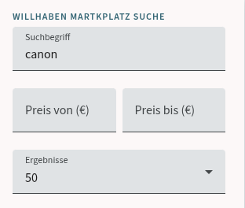
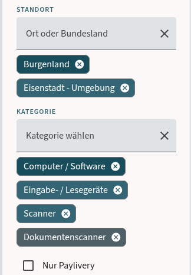
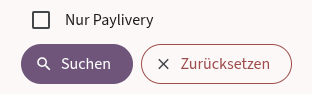
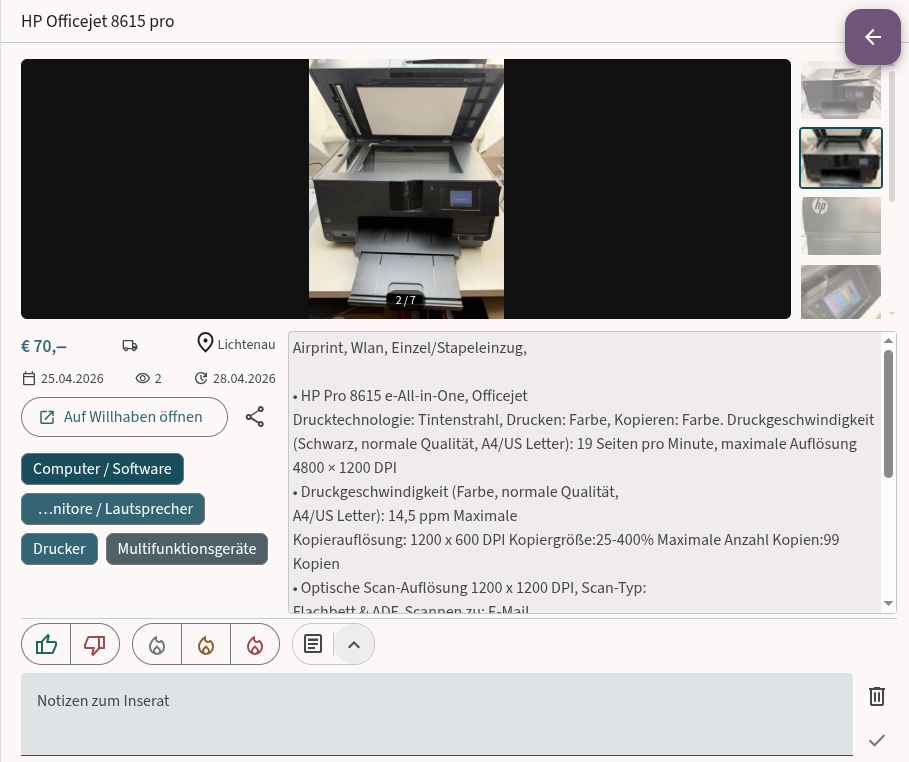
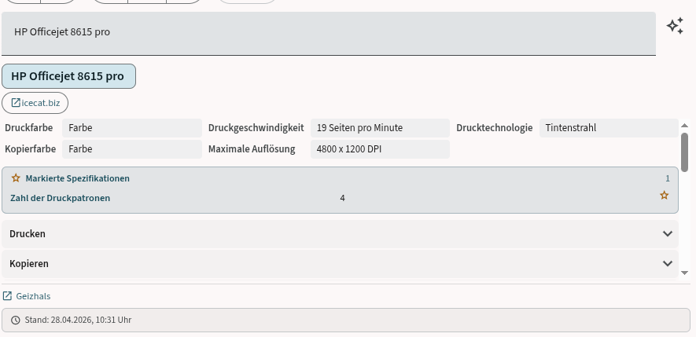

# Querchecker

## Vision

Querchecker entstand aus einem konkreten Bedarf: die Suche nach einem gebrauchten Drucker auf dem Willhaben Marktplatz (Kleinanzeigen). Welche Modelle haben noch verfügbare Patronen? Gibt es Ersatzteile? Hat er Duplex? Diese Fragen sind auf Willhaben selbst mühsam zu beantworten — man jongliert zwischen Inseraten, Geizhals und Herstellerseiten, verliert spätestens ab dem zweiten Inserat den Überblick und fängt von vorne an.

Querchecker bündelt diesen Workflow in einer einzigen, fokussierten Oberfläche. Gleichzeitig ist es ein Showcase dafür, wie sich moderne KI-Funktionen sinnvoll in eine reale Alltagsanwendung integrieren lassen — nicht als Gimmick, sondern als echter Mehrwert.

Mir war dabei wichtig:

- **Durchdachtes UI-Design** — klare Struktur, konsistentes Material Design v3 Theme (TealMist), angenehme Interaktion
- **Aktueller, sauberer Stack** — Angular 21+, Spring Boot 3.5, @ngrx/signals, keine veralteten Patterns
- **AI sinnvoll eingesetzt** — automatische Produkterkennung, Spezifikations-Lookup, strukturierte Datenextraktion
- **Robustheit** — Edge Cases wie API-Ausfälle, Kontingent-Limits oder ungültige LLM-Responses werden explizit behandelt; kritische Komponenten sind unit-getestet
- **Durchgehender Workflow** — Suche, Bewertung und KI-Recherche greifen ineinander und ergeben eine tatsächlich nutzbare Anwendung, keine Feature-Demo

---

## Die App

## 🔍 Suche & Filterung

Damit du nicht den Überblick verlierst, kannst du deine Suche im Querchecker sehr präzise steuern. Der Filter-Bereich ist in drei logische Schritte unterteilt:

| Was & Wie viel                                                                                                                                                                             | 📍Wo &  Kategorie                                                                                                                                                   | Extras & Aktion                                                                                                                                                                   |
| :----------------------------------------------------------------------------------------------------------------------------------------------------------------------------------------- | :------------------------------------------------------------------------------------------------------------------------------------------------------------------ | :-------------------------------------------------------------------------------------------------------------------------------------------------------------------------------- |
|                                                                                                                                |                                                                                                         |                                                                                                                       |
| **Deine Basis-Suche**<br>Hier gibst du deinen **Suchbegriff** ein und legst dein **Budget** fest. Du entscheidest auch gleich vorab, wie viele **Ergebnisse** du pro Seite laden möchtest. | **Standort & Kategorien**<br>Grenze deine Suche auf ein **Bundesland** oder einen **Bezirk** ein. Über die **Kategorie** filterst du gezielt nach Hardware-Gruppen. | **Sicherheit & Start**<br>Aktiviere **Nur Paylivery**, wenn du nur Angebote mit Käuferschutz sehen willst. Mit einem Klick auf **Suchen** geht es los oder du setzt alles zurück. |

---

### Detailansicht & Annotationen



Die Detailansicht zeigt alle Inseratsinformationen, eine vollständige Bildergalerie mit Zoom und Navigation, sowie die persönlichen Annotationen: Notizen (Autosave), Rating, Interesse-Level und Tags.

---

### Spec-Lookup & Item Research



Beim Öffnen eines Inserats extrahieren KI-Modelle automatisch den Produktnamen. Auf Knopfdruck werden technische Spezifikationen nachgeschlagen — Brave Search findet relevante Quellen, ein LLM extrahiert daraus strukturierte Quick Facts. Bevorzugte Felder (z.B. Duplex, Patronen-Verfügbarkeit) erscheinen immer prominent. Ein Klick öffnet den aktuellen Marktpreis auf Geizhals.

Mehr zur KI-Konfiguration (lokal / remote): → [docs/api-setup.md](docs/api-setup.md)
Mehr zu Produktdatenquellen und Fallback-Logik: → [docs/spec-lookup.md](docs/spec-lookup.md)

---

## Geplante Features

- [ ] Mehrere Suchprofile / gespeicherte Suchen
- [ ] Mobile-optimiertes Layout

Bei positivem Feedback bin ich offen für weitere Features, sofern sie mich fachlich reizen und der Aufwand vertretbar ist.

---

## Stack

| Schicht   | Technologie                                                    |
| --------- | -------------------------------------------------------------- |
| Frontend  | Angular 21+, Angular Material v3, @ngrx/signals SignalStore    |
| Backend   | Spring Boot 3.5, Java 21, Lombok, SpotBugs                     |
| Datenbank | PostgreSQL 16                                                  |
| KI / LLM  | OpenRouter / Groq (OpenAI-kompatibel) oder lokal via llama.cpp |
| Websuche  | Brave Search API                                               |
| Prod      | Docker, nginx, Traefik (SSL via Let's Encrypt)                 |

---

## Quickstart (Dev)

**Voraussetzungen:** Docker, Java 21, Node.js 20+

```bash
# PostgreSQL starten
docker compose up -d

# Backend
cd backend && mvn spring-boot:run

# Frontend
cd frontend && npm install && npm start

# Nach Backend-API-Änderungen
cd frontend && npm run generate-api
```

**Hot Reload**: Datei speichern → Spring DevTools erkennt die Änderung und startet den Context automatisch neu. JVM-Neustart nur bei Prozess-Crash nötig.

**API-Keys**: Für KI-Extraktion und Spec-Lookup werden API-Keys für OpenRouter/Groq und Brave Search benötigt. → [Details: docs/api-setup.md](docs/api-setup.md)

## Struktur

```
querchecker/
├── backend/                ← Spring Boot (Maven)
├── frontend/               ← Angular 21+
├── docs/
│   ├── screenshots/        ← Screenshots für README
│   ├── api-setup.md        ← LLM-Konfiguration (lokal & remote)
│   └── spec-lookup.md      ← Produktdatenquellen & Fallback-Logik
├── docker-compose.yml      ← Dev: nur PostgreSQL
├── docker-compose.prod.yml ← Prod: nginx + backend + postgres
└── README.md
```

## Deployment

```bash
docker compose -f docker-compose.prod.yml up -d
```

Traefik-Labels in `docker-compose.prod.yml` anpassen (Domain, certresolver).
