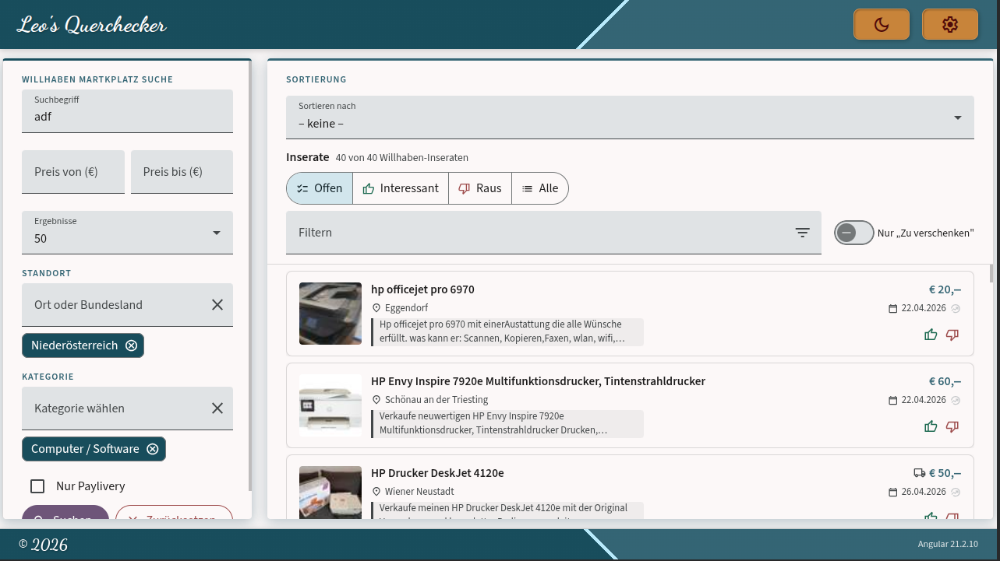

# Querchecker

## Vision

Querchecker entstand aus einem konkreten Bedarf: die Suche nach einem gebrauchten Drucker auf dem Willhaben Marktplatz (Kleinanzeigen). Welche Modelle haben noch verfügbare Patronen? Gibt es Ersatzteile? Hat er Duplex? Diese Fragen sind auf Willhaben selbst mühsam zu beantworten — man jongliert zwischen Inseraten, Geizhals und Herstellerseiten, verliert spätestens ab dem zweiten Inserat den Überblick und fängt von vorne an.

Querchecker bündelt diesen Workflow in einer einzigen, fokussierten Oberfläche. Gleichzeitig ist es ein Showcase dafür, wie sich moderne KI-Funktionen sinnvoll in eine reale Alltagsanwendung integrieren lassen — nicht als Gimmick, sondern als echter Mehrwert.

Mir war dabei wichtig:

- **Durchdachtes UI-Design** — klare Struktur, konsistentes Material Design v3 Theme (TealMist), angenehme Interaktion
- **Aktueller, sauberer Stack** — Angular 21+, Spring Boot 3.5, @ngrx/signals, keine veralteten Patterns
- **AI sinnvoll eingesetzt** — automatische Produkterkennung, Spezifikations-Lookup, strukturierte Datenextraktion
- **Robustheit** — Edge Cases wie API-Ausfälle, Kontingent-Limits oder ungültige LLM-Responses werden explizit behandelt; kritische Komponenten sind unit-getestet
- **Durchgehender Workflow** — Suche, Bewertung und KI-Recherche greifen ineinander und ergeben eine tatsächlich nutzbare Anwendung, keine Feature-Demo

---

## Die App



Der Workflow ist bewusst linear gehalten: Du startest eine Suche, bekommst deine Ergebnisse als Karten, und klickst dich in die Detailansicht — ohne dass die Seite neu lädt. Die drei Zustände (Suche, Ergebnisse, Detail) wechseln fließend ineinander, du verlierst nie den Kontext.

In der Detailansicht siehst du alle Bilder des Inserats in einer Galerie, kannst das Inserat bewerten (👍/👎), Notizen hinzufügen (werden automatisch gespeichert) und direkt in die KI-gestützte Produktanalyse wechseln. Dort schlägt Querchecker automatisch einen Produktnamen vor — du kannst ihn korrigieren, und auf Knopfdruck werden technische Spezifikationen nachgeschlagen: aus Quellen wie Icecat, GSMArena oder FlatpanelsHD, aufbereitet von einem LLM zu strukturierten Quick Facts. Felder, die dir wichtig sind (z.B. Duplex-Druck, Akkukapazität), kannst du als bevorzugt markieren — sie erscheinen dann immer ganz oben.

Was du **nicht** siehst: wie viele API-Aufrufe das im Hintergrund kostet. Querchecker arbeitet mit freien API-Kontingenten (Groq, Brave Search) und trackt die Nutzung intern — in den Einstellungen gibt es einen Usage Monitor, der dir zeigt wie weit du noch von deinem Tageslimit entfernt bist.

---

### 🔍 Suche & Filterung

Damit du nicht den Überblick verlierst, kannst du deine Suche im Querchecker sehr präzise steuern. Der Filter-Bereich ist in drei logische Schritte unterteilt:

| Was & Wie viel                                                                                                                                                                             | 📍Wo &  Kategorie                                                                                                                                                   | Extras & Aktion                                                                                                                                                      |
| :----------------------------------------------------------------------------------------------------------------------------------------------------------------------------------------- | :------------------------------------------------------------------------------------------------------------------------------------------------------------------ | :------------------------------------------------------------------------------------------------------------------------------------------------------------------- |
|                                                                                                                                |                                                                                                         |                                                                                                          |
| **Deine Basis-Suche**<br>Hier gibst du deinen **Suchbegriff** ein und legst dein **Budget** fest. Du entscheidest auch gleich vorab, wie viele **Ergebnisse** du pro Seite laden möchtest. | **Standort & Kategorien**<br>Grenze deine Suche auf ein **Bundesland** oder einen **Bezirk** ein. Über die **Kategorie** filterst du gezielt nach Hardware-Gruppen. | **Suche**<br>Aktiviere **Nur Paylivery**, wenn du nur Angebote mit Käuferschutz sehen willst. Mit einem Klick auf **Suchen** geht es los oder du setzt alles zurück. |

---

### 📋 Detailansicht und 🔬 KI-Produktanalyse

| 📋 Detailansicht & Anmerkungen                                                                                                                               | 🔬 KI-Produktanalyse                                                                                                                                                                                                                                                                                  |
| :----------------------------------------------------------------------------------------------------------------------------------------------------------- | :---------------------------------------------------------------------------------------------------------------------------------------------------------------------------------------------------------------------------------------------------------------------------------------------------- |
|                                                                                                        |                                                                                                                                                                                                                                            |
| Alle Inseratsinformationen, eine Bildergalerie mit Zoom und Navigation sowie persönliche Annotationen: Notizen (Autosave), Rating, Interesse-Level und Tags. | KI-Modelle extrahieren automatisch den Produktnamen. Auf Knopfdruck werden technische Spezifikationen nachgeschlagen und zu strukturierten Quick Facts aufbereitet. Bevorzugte Felder (z.B. Duplex, Patronen-Verfügbarkeit) erscheinen immer prominent. Ein Klick öffnet den Marktpreis auf Geizhals. |

---

## Stack

| Schicht   | Technologie                                                    |
| --------- | -------------------------------------------------------------- |
| Frontend  | Angular 21+, Angular Material v3, @ngrx/signals SignalStore    |
| Backend   | Spring Boot 3.5, Java 21, Lombok, SpotBugs                     |
| Datenbank | PostgreSQL 16                                                  |
| KI / LLM  | OpenRouter / Groq (OpenAI-kompatibel) oder lokal via llama.cpp |
| Websuche  | Brave Search API                                               |
| Prod      | Docker, nginx, Traefik (SSL via Let's Encrypt)                 |
| Version   | 0.2.0                                                          |

---

## Quickstart

### Lokal (Dev)

<table>
<tr>
<td valign="top" width="45%">
<strong>Voraussetzungen</strong><br><br>
Docker &nbsp;·&nbsp; Java 21 &nbsp;·&nbsp; Node.js 20+

```bash
# PostgreSQL starten
docker compose up -d

# Backend

cd backend && mvn spring-boot:run

# Frontend

cd frontend && npm install && npm start

# Nach Backend-API-Änderungen

cd frontend && npm run generate-api
```

</td>
<td valign="top" width="55%">
<strong>Ports (lokal)</strong><br><br>
<table>
<tr><th align="left">Dienst</th><th align="left">URL</th></tr>
<tr><td>Frontend</td><td>http://localhost:14072</td></tr>
<tr><td>Backend</td><td>http://localhost:14070</td></tr>
<tr><td>PostgreSQL</td><td>localhost:14071</td></tr>
</table>
</td>
</tr>
</table>

**Hot Reload**: Datei speichern → Spring DevTools erkennt die Änderung und startet den Context automatisch neu. JVM-Neustart nur bei Prozess-Crash nötig.

**API-Keys**: Für KI-Extraktion und Item Research werden API-Keys für OpenRouter/Groq und Brave Search benötigt. → Details: [Admin Guide](docs/admin-guide.md)

### Deployment (Prod)

```bash
docker compose -f docker-compose.prod.yml up -d
```

Traefik-Labels in `docker-compose.prod.yml` anpassen (Domain, certresolver).

---

## Struktur

```
querchecker/
├── backend/                ← Spring Boot (Maven)
├── frontend/               ← Angular 21+
├── docs/
│   ├── screenshots/        ← Screenshots für README
│   ├── concepts/           ← Design-Konzepte (Provider-Konfiguration, …)
│   └── *.md                ← Technische Dokumentation
├── docker-compose.yml      ← Dev: nur PostgreSQL
├── docker-compose.prod.yml ← Prod: nginx + backend + postgres
└── README.md
```

---

## Dokumentation

| 📐 Technisch & Design                                                                                                            | ⚙️ Setup & Betrieb                                                                                                        |
| :------------------------------------------------------------------------------------------------------------------------------- | :------------------------------------------------------------------------------------------------------------------------ |
| 🏗️ [Architecture & Design Decisions](docs/architecture.md)<br>SignalStore, SSE, conditional model registration, OpenAPI workflow | 📖 [Admin Guide](docs/admin-guide.md)<br>Installation, Konfiguration und Betrieb (API-Keys, Provider-Setup, Deployment)   |
| 🛡️ [Robustness & Error Handling](docs/robustness.md)<br>API-Ausfälle, Rate-Limiting, Quota-Verwaltung, Server-Restarts           | ⚙️ [Provider-Konfiguration](docs/concepts/provider-config.md)<br>KI-Modelle und Web-Suche konfigurieren (lokal vs. Cloud) |
| 🤖 [KI-Produktanalyse](docs/ki-produktanalyse.md)<br>Produktname-Extraktion und Item Research                                    | 💻 [Lokale Modelle](docs/local-models.md)<br>LLM lokal statt Cloud betreiben                                              |
| ⚙️ [Extraction Engine](docs/extraction-engine.md)<br>Queue-Architektur, Status-Maschine, Modell-Registrierung                    |                                                                                                                           |

---

## Geplante Features

- [ ] Mobile-optimiertes Layout
- [ ] Lokales Modell als Fallback — wenn die Remote-LLM-API nicht erreichbar ist, automatisch auf das lokal verfügbare Modell ausweichen (nahtlose Redundanz)
- [ ] Ähnliche Inserate — nach erkanntem Produktnamen wird in den aktuellen Suchergebnissen nach weiteren Inseraten des gleichen Produkts gesucht und direkt in der Detailansicht angezeigt. Kein zusätzlicher API-Aufruf — rein clientseitig über die bereits geladenen Listings.
- [ ] Provider-Wechsel zur Laufzeit — Web-Such-Provider (Brave / Google Discovery) ohne App-Neustart umschalten.

Bei positivem Feedback bin ich offen für weitere Features, sofern sie mich fachlich reizen und der Aufwand vertretbar ist.
