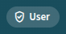
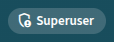

# Querchecker Auth Guide

Zugriffscodes, Rollen und Zugriffsverwaltung — für Nutzer, Administratoren und Entwickler.

**Kurzfassung:** Mit einem Zugriffscode meldest du dich einmalig an; der Browser erhält dafür ein Cookie, das weitere Berechtigungen freischaltet — von KI-Funktionen mit Tageskontingent (User) bis zur Verwaltung (Superuser). Die Umsetzung ist bewusst schlank: ein Proof of Concept, um kostenverursachende KI-Funktionen eingeschränkt freizugeben — kein vollwertiges Benutzerkonten-System (keine Registrierung, keine Namen, keine Passwörter).

> Diese Seite ist die vollständige Auth-Dokumentation. Noch offene Punkte: [berechtigungen-konzept.md](auth/berechtigungen-konzept.md).

---

## Wie Zugriff funktioniert

Querchecker kennt drei Zustände:

| Zustand | Anzeige im Header | Was du siehst | KI-Funktionen |
| --- | :---: | --- | --- |
| **Gast** (kein Zugriffscode) |  | Normale Suche, alle Basis-Funktionen | ❌ Ausgeblendet |
| **User** (Zugriffscode eingegeben) |  | Wie Gast + eigenes Tageskontingent | ✅ Spec-Lookup, Produktanalyse |
| **Superuser** |  | Wie User, ohne Kontingent-Limit | ✅ + Zugriffsverwaltung, Usage-Monitor, Provider-Einstellungen |

Der aktuelle Zustand ist jederzeit am Rollen-Chip oben im Header sichtbar (Icon + „Gast" / „User" / „Superuser"). Klick auf den Chip zeigt eine Kontingent-Snackbar: „X/Y KI-Anfragen heute genutzt" (User), „kein Kontingent-Limit" (Superuser) bzw. ein neutraler Hinweis (Gast).

Ohne Zugriffscode ist Querchecker voll nutzbar — nur die KI-gestützten Funktionen (automatische Produkterkennung, Spezifikations-Lookup) bleiben Nutzern mit Code vorbehalten, da sie externe API-Kontingente verbrauchen.

---

## Als Nutzer: Zugriffscode eingeben

1. **Einstellungen** öffnen
2. Zugriffscode-Feld ausfüllen, **Anmelden** klicken
3. Die Anmeldung gilt für den Browser (Cookie), kein erneutes Eingeben nötig — läuft nach 30 Tagen Inaktivität ab
4. **Abmelden** über denselben Bereich in den Einstellungen

Zugriffscodes gibt der Administrator aus (siehe unten). Ein Code ist einmalig sichtbar — verloren gegangene Codes können nicht wiederhergestellt werden, nur ein neuer Code ausgestellt.

### Dein Tageskontingent

Jeder Code hat ein Tageskontingent an KI-Anfragen. **Eine Anfrage = ein Spezifikations-Lookup** (Suchfeld in der Produktrecherche).

**Die automatische Extraktion — die Zusammenfassung, die beim Öffnen eines Inserats erscheint — zählt NICHT gegen dein Tageskontingent.** Sie hat einen eigenen, großzügigen Hintergrund-Schutz, der im Normalgebrauch unsichtbar bleibt. Ebenfalls nicht gezählt: Ergebnisse aus dem Cache und fehlgeschlagene Anfragen wegen Provider-Ausfall.

- **Stand einsehen:** Klick auf den Rollen-Chip im Header („X/Y KI-Anfragen heute genutzt") oder in den Einstellungen neben **Abmelden**
- **Kontingent erschöpft:** Der Lookup wird mit einem Hinweis abgelehnt; ab dem nächsten Tag steht das Kontingent wieder voll zur Verfügung
- **Superuser** haben kein Limit

---

## Als Superuser: Zugriffsverwaltung

Sichtbar in **Einstellungen → Zugriffsverwaltung** (nur für Superuser-Konten).

### Neuen Zugriffscode erstellen

1. **Neuen Zugriffscode generieren** klicken
2. Rolle wählen: `USER` (mit Tageskontingent) oder `SUPERUSER` (kein Limit)
3. Bei `USER`: Tageskontingent festlegen (Vorschlag: 10)
4. Bestätigen — der Klartext-Code wird **einmalig** angezeigt. Sofort kopieren und weitergeben — er lässt sich später nicht mehr abrufen.

### Codes verwalten

Tabelle zeigt alle Codes mit Rolle, Kontingent, Erstellungsdatum, letzter Nutzung und Status:

- **Sperren** — Code funktioniert sofort nicht mehr (auch laufende Sitzungen werden beendet)
- **Entsperren** — Code wieder aktivieren
- **Löschen** — Code endgültig entfernen
- **Bearbeiten** — Rolle oder Kontingent ändern

Dein eigener aktiver Code ist mit **„Du"** markiert und lässt sich nicht bearbeiten, sperren oder löschen — Schutz vor versehentlichem Selbst-Aussperren.

### Wichtig

- Es gibt keine Codes-Wiederherstellung — nur Neuausstellung
- Gesperrte Codes bleiben in der Liste sichtbar (Historie), zählen aber nicht mehr
- Das Tageskontingent wird **pro Kalendertag gezählt und durchgesetzt** — Kontingent-Änderungen per **Bearbeiten** wirken sofort, auch auf den laufenden Tag

---

## Bootstrap: ersten Superuser-Zugriff einrichten

Bei einer frischen Installation gibt es noch keinen Zugriffscode. Erster Zugang nur per direktem Datenbank-Eintrag:

1. Zufälligen Code wählen, z.B. `openssl rand -hex 32`
2. Hash bilden: `echo -n "<code>" | sha256sum`
3. In der Datenbank einfügen:
   ```sql
   INSERT INTO access_key (secret_key_hash, role, quota_limit, used, revoked)
   VALUES ('<sha256-hex>', 'SUPERUSER', 0, false, false);
   ```
4. Mit dem gewählten Klartext-Code normal über die Einstellungen anmelden — danach weitere Codes bequem über die Zugriffsverwaltung ausstellen

---

## Technik (für Entwickler)

### Rollenmodell & Laufzeit

Jeder Zugriffscode trägt eine Rolle. Das `Role`-Enum kennt nur `USER` und `SUPERUSER`. **`GUEST` ist bewusst kein Enum-Wert** — „keine Authentication vorhanden" heißt automatisch: nur öffentliche Endpoints. Ebenso gibt es keine Zwischenrollen (kein „Premium") — mehr Kontingent ist nur eine höhere Zahl am Zugriffscode.

**Zwei Filter, eine gemeinsame Ziel-Struktur** (`QuerCheckerPrincipal`; Reihenfolge = Priorität; hat der erste gesetzt, überspringt der zweite):

| # | Filter | Aktiv wenn | Ergebnis |
|---|---|---|---|
| 1 | `LocalProfileAuthFilter` | Spring-Profil `!prod` | `withoutKey(SUPERUSER)` für jede Anfrage |
| 2 | `SessionCookieAuthFilter` | Gültige Session in DB | `withKey(role, accessKeyId)` |
| – | keiner greift | — | keine Authentication → GUEST |

Beide setzen die passende `GrantedAuthority` (`ROLE_SUPERUSER`/`ROLE_USER`), sodass `@PreAuthorize("hasRole('SUPERUSER')")` unabhängig vom Auth-Weg funktioniert.

**Dev-Modus:** Jeder Betrieb ohne `prod`-Profil (normales `mvn spring-boot:run`) läuft automatisch als SUPERUSER — Semantik: „diese Instanz ist kein Produktions-Deployment". Ein Zugriffscode-Login ist in diesem Zustand wirkungslos (Filter 1 hat Vorrang); die Einstellungen zeigen das Zugriffscode-Feld deshalb deaktiviert mit Erklärung an.

**Genau zwei Prüf-Stellen:**
1. AI-/Brave-Endpoints: `authenticated()` → danach Kontingent-Check
2. Settings-Spezialteile (Zugriffsverwaltung, Usage-Monitor, Provider-Config): `hasRole('SUPERUSER')`

Alles andere (normale Suche, allgemeine UI) ist `permitAll`.

### Session-Mechanik (Zugriffscode-Login → Session-Cookie)

- Login: Zugriffscode im **Body** an `POST /api/auth/login-with-key` (nie als URL-Parameter — Server-/Proxy-Logs, Browser-Historie) → Session-Token als **HttpOnly-Cookie** `qc_session` (30 Tage)
- Zugriffscodes und Session-Tokens werden **nur als SHA-256-Hash** gespeichert. SHA-256 statt BCrypt reicht: hochentropische UUIDs, kein Wörterbuch-Angriff möglich.
- **Clientseitig wird nichts gespeichert** — kein localStorage, kein Token im Angular-State. Nach F5 fragt die App den Login-Status (inkl. Kontingent) per `GET /api/auth/me` ab.
- **Prüfung pro Request gegen die DB** — dafür wirken Sperren sofort; **Sperren** löscht zusätzlich alle Sessions des Zugriffscodes.
- **Sliding Expiration statt Refresh-Token:** Session verlängert sich bei Nutzung (gedrosselt, max. 1 DB-Write pro 24h). Serverseitiges `expiresAt` ist maßgeblich, das Cookie-Max-Age nur Komfort.
- **CSRF:** durch `SameSite=Strict` abgedeckt.

### Kontingent-Modell (drei Ebenen)

**Ebene 1 — Provider-Kontingent** (global, pro Provider): Schutz gegen Erschöpfung externer APIs (Brave, Groq, …). Bei Erschöpfung sehen **alle** Nutzer die Fehlermeldung — auch Superuser.

**Ebene 2 — Zugriffscode-Kontingent** (Tageskontingent): zählt **Nutzeraktionen**, nicht Provider-Calls — „Specs laden" = 1 Einheit, egal wie viele interne Calls.

- **Check vor der Pipeline, eine DB-Query entscheidet.** Erschöpft → `KEY_QUOTA_EXCEEDED` — bewusst getrennt vom Ebene-1-Status `QUOTA_EXCEEDED` und **nie gecacht** (pro Nutzer; ein globaler Cache-Eintrag würde alle sperren).
- **Verbrauch nur nach erfolgreichem Abschluss:** Cache-Hit, Provider-Erschöpfung und der asynchrone Rate-Limit-Retry buchen nicht. Race-Conditions per atomarem Upsert in der DB.
- **Superuser und Gast:** kein Check, kein Verbrauch.
- Client sieht keine Rohdaten — nur Accepted/Rejected; Detailzahlen nur im Usage-Monitor (superuser-only).

**Ebene 2b — Extraktions-Hintergrundschutz:** Die DL-Extraktion (automatisches Produktname-Pre-Fetch beim Öffnen einer Detailansicht) zählt nicht gegen das Lookup-Kontingent (keine bewusste User-Aktion), ist aber still gedeckelt:

- **Rate-Limit:** min. 2s Abstand pro Zugriffscode; **Tagesvolumen:** 5× das Lookup-Kontingent
- **Bei Blockade:** neue Runs werden sofort abgebrochen (`CANCELLED`) — erneutes Öffnen der Detailansicht holt automatisch nach. Die UI zeigt eine differenzierte, aber zahlenlose Meldung — kein Blocking wie beim Lookup.

### Design-Entscheidungen (Warum, kompakt)

- **Session-Cookie statt JWT+Refresh:** Stateless-Vorteil minimal — jede AI-Anfrage braucht ohnehin einen DB-Zugriff (Kontingent). Spart JWT-Dependency, Secret, Refresh-Endpoint, Token-Rotation, 401-Retry-Interceptor. Bonus: Sperren greifen sofort.
- **Kontingent am Zugriffscode, nicht an der Rolle:** kein „Premium"-Rollenwert; großzügiger Nutzer = höheres `quotaLimit` an seinem Code.
- **Kein IP-Allowlist-Filter, kein eigenes `local`-Profil:** kein Traefik/Cloud-Setup vorhanden, Admin-IP evtl. dynamisch; `@Profile("!prod")` reicht.
- **Bootstrap per manuellem SQL-Insert** statt automatisch generiertem Zugriffscode aus einer Env-Var: einfacher, kein zusätzlicher Code-Pfad.
- **„Eine AI-Anfrage" = nur Spec-Lookup** (Nutzer-Entscheidung 2026-07-08); DL-Extraktion ist Vorbereitung, keine bewusste Aktion → eigener Hintergrund-Schutz statt sichtbarem Kontingent.
- **Consume nach Abschluss statt bei Start;** Race-Absicherung via atomarem ON-CONFLICT-Upsert.
- **Kein Login-Screen:** Code-Eingabe als Status-Element in den Einstellungen, keine eigene Route, kein erzwungener Login.

---

## See Also

- 📖 [Admin Guide](admin-guide.md) — Installation, Konfiguration und Betrieb
- 📋 [Offene Punkte](auth/berechtigungen-konzept.md) — was beim Auth-Konzept noch aussteht
