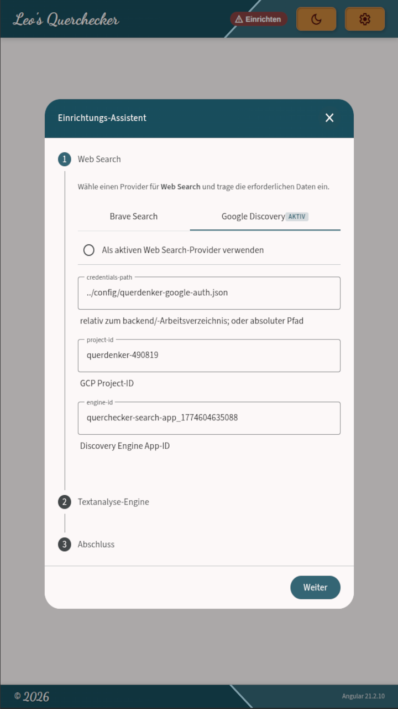

# Querchecker — Developer Setup

Schritt-für-Schritt vom Clone bis zum ersten erfolgreichen Start im Dev-Modus.

---

## Voraussetzungen

| Tool | Version | Prüfen |
|---|---|---|
| Docker | aktuell | `docker --version` |
| Java | 21 | `java --version` |
| Node.js | 20+ | `node --version` |
| Maven | 3.9+ | `mvn --version` (oder via Wrapper `./mvnw`) |

---

## Repository klonen

```bash
git clone <repo-url>
cd querchecker
```

---

## API-Keys konfigurieren

Querchecker startet auch ohne Konfiguration (nur Willhaben-Suche). Für **Textanalyse-Engine** und **Item Research** brauchst du:

| Provider | Zweck | Registrierung |
|---|---|---|
| Groq | LLM-Extraktion (Free Tier: 500k Tokens/Tag) | https://console.groq.com |
| Brave Search | Web Search für Spec-Lookup (Free Tier: 1000 Req/Monat) | https://api.search.brave.com |
| OpenRouter | Alternative zu Groq (optional) | https://openrouter.ai |

### Manuell

**secrets.yml erstellen:**

```bash
cp config/secrets-example.yml config/secrets.yml
```

Keys eintragen:

```yaml
# config/secrets.yml — nie in Git einchecken
querchecker:
  api:
    limits:
      brave:
        api-key: 'dein-brave-key'
      groq:
        api-key: 'dein-groq-key'
```

Aktiven Provider in `config/querchecker.yml` prüfen (Standard: Groq + Brave):

```yaml
querchecker:
  llm:
    mode: API                  # API (Standard) | LOCAL
    active-provider: GROQ      # GROQ | OPENROUTER
  api:
    search:
      active-provider: BRAVE   # BRAVE | GOOGLE_DISCOVERY
```

Backend neu starten.

### Einrichtungs-Assistent

Der Assistent ist unter **Einstellungen → Provider-Konfiguration → Einrichtungs-Assistent** erreichbar — er erscheint automatisch beim ersten Start wenn Provider fehlen.

Der **Einrichtungs-Assistent** führt dich durch die Konfiguration:

- **Web Search Provider** — API-Key von Brave oder JSON-File von Google Discovery
- **KI-Provider** — API-Key von Groq oder OpenRouter und Modellname
- `secrets.yml` wird automatisch gespeichert (falls Backend-Schreibzugriff) oder zum **Download** angeboten → manuell in `config/` ablegen
- Backend neu starten



---

## PostgreSQL starten

```bash
docker compose up -d
```

Startet PostgreSQL auf Port **14071**. Datenbankname: `mydb`, User: `myuser`.

Die Credentials sind in `backend/src/main/resources/application.yml` hinterlegt und können über Umgebungsvariablen überschrieben werden:

| Variable | Standard |
|---|---|
| `QUERCHECKER_DB_HOST` | `localhost:5432` |
| `QUERCHECKER_DB_USER` | `myuser` |
| `QUERCHECKER_DB_PASSWORD` | `mypassword` |

---

## Backend starten

```bash
cd backend && mvn spring-boot:run
```

Beim ersten Start:
- **Flyway** führt alle DB-Migrationen automatisch durch
- **Seeder** befüllen Tabellen (`dl_model_config`, `category_search_source`, `category_spec_preference`)
- Provider-Status wird geprüft und geloggt

**Erfolg sieht so aus:**

```
Started QuercheckerApplication in X.XXX seconds
[ApiRestClientConfig] Groq API key: CONFIGURED
[ProviderStatus] search → CONFIGURED
[ProviderStatus] llm → CONFIGURED
```

Falls `MISSING/EMPTY`: `config/secrets.yml` fehlt oder falsche Keys. Pfad relativ zum `backend/`-Arbeitsverzeichnis.

**Hot Reload:** Datei speichern → Spring DevTools erkennt die Änderung und startet den Context automatisch neu. JVM-Neustart nur bei Prozess-Crash nötig.

---

## Frontend starten

```bash
cd frontend && npm install && npm start
```

Öffnet auf `http://localhost:14072`.

**Nach Backend-API-Änderungen** (neue Endpoints, geänderte DTOs):

```bash
cd frontend && npm run generate-api
```

Generiert den Angular API-Client aus dem OpenAPI-Spec des laufenden Backends (`localhost:14070/v3/api-docs`). Backend muss laufen.

Alle Ports: → [README Quickstart](../README.md#lokal-dev)

---

## Debugging

DEBUG-Logging aktivieren in `backend/src/main/resources/application.yml`:

```yaml
logging:
  level:
    at.querchecker: DEBUG
```

Nützliche Log-Patterns:

| Pattern | Bedeutung |
|---|---|
| `[ProductLookupService] === LOOKUP START ===` | Spec-Lookup gestartet |
| `[ProductLookupService] Found X sources` | Lookup-Quellen gefunden |
| `Brave search rate limited — retryAfter=Xs` | HTTP 429 von Brave |

---

## Troubleshooting

| Problem | Ursache | Lösung |
|---|---|---|
| `MISSING/EMPTY` API key beim Start | `secrets.yml` nicht gefunden oder Platzhalter-Key | `config/secrets.yml` prüfen, Pfad relativ zu `backend/` |
| `Connection refused` (DB) | PostgreSQL nicht gestartet | `docker compose up -d` |
| `generate-api` schlägt fehl | Backend nicht erreichbar | Backend erst starten, dann API-Client generieren |
| `UnsatisfiedLinkError` (llama.cpp) | Native Library fehlt | `sudo zypper install libstdc++6` — nur bei `mode: LOCAL` relevant |
| Modell startet nicht (LOCAL) | GGUF-Datei fehlt | `cd backend/src/main/resources/models && python download_llama32.py` |

💻 [Lokale Modelle](local-models.md)  
📖 [Admin Guide](admin-guide.md)
